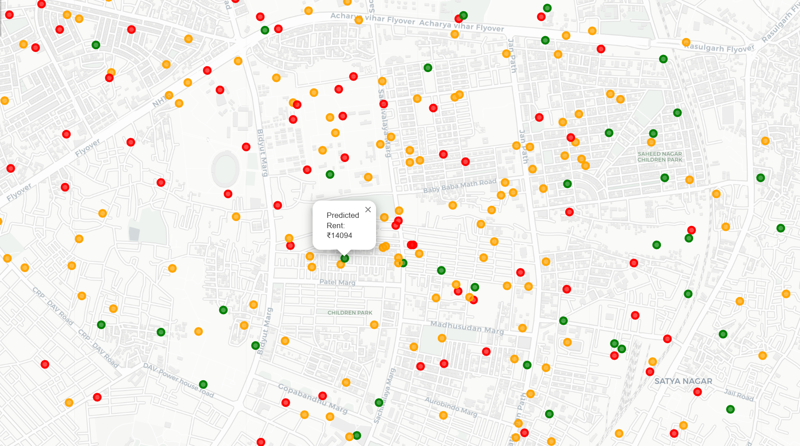
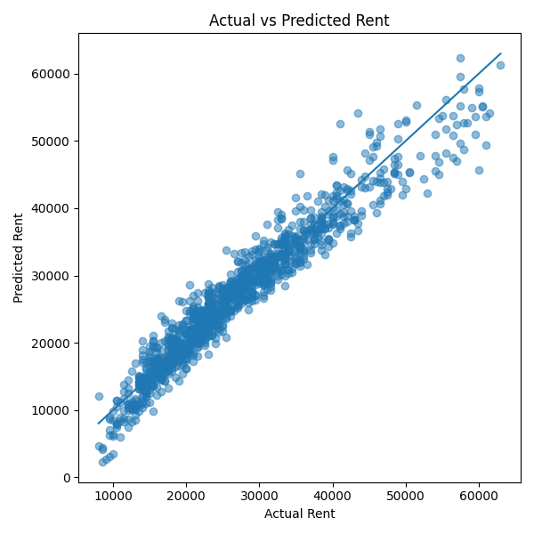

# Bhubaneswar Rent Prediction (ML + GIS)

An end-to-end machine learning project that predicts housing rent in Bhubaneswar and visualizes results on an interactive map.

---

## Live Demo
https://armaanjain-byte.github.io/BBS_Rent_Prediction-ML/map.html

---

## Overview

This project builds a predictive model for rental prices using structured data and extends it with geospatial visualization.

The objective was to:
- Engineer meaningful features from raw data
- Ensure model generalization (avoid overfitting)
- Compare multiple models
- Deploy predictions in an interactive format

---

## Visualization

### Rent Prediction Map

### Model Performance (Actual vs Predicted)

---

## Tech Stack

- Python
- Pandas, NumPy
- Scikit-learn
- Folium
- Git & GitHub
- GitHub Pages

---

## Dataset

The dataset consists of rental listings in Bhubaneswar, including:
- Geographic coordinates (latitude, longitude)
- Property features
- Accessibility-related attributes

The data was cleaned, audited, and checked for leakage before modeling.

---

## Feature Engineering

Custom features were created to capture real-world factors:

- `job_access_score`  
  Based on proximity to employment hubs

- `overall_access_score`  
  Combined accessibility metric

- Inverse distance transformations to emphasize proximity effects

These features improved both model performance and stability.

---

## Model Development

Models evaluated:
- Linear Regression
- Ridge Regression
- Lasso Regression
- Random Forest Regressor

Evaluation method:
- 5-Fold Cross Validation (R² score)

---

## Results

| Model              | R² Score | Notes          |
|--------------------|--------|------------------|
| Linear Regression  | 0.927  | Best performance |
| Ridge              | 0.923  | Stable           |
| Lasso              | 0.926  | Stable           |
| Random Forest      | 0.904  | Higher variance  |

---

## Key Insight

Linear Regression outperformed more complex models, indicating that:
- The dataset has largely linear relationships
- Feature engineering effectively captured the underlying patterns
- Additional model complexity did not improve generalization

---

## Deployment

The project is deployed using GitHub Pages:
https://armaanjain-byte.github.io/BBS_Rent_Prediction-ML/map.html

---

## Project Structure

BBS_Rent_Prediction-ML/
│
├── data/
├── notebooks/
│   └── 01_eda.ipynb
├── outputs/
│   ├── map.png
│   ├── actual_vs_predicted.png
├── map.html
├── README.md
├── LICENSE

---

## Conclusion

This project demonstrates:
- End-to-end ML pipeline development
- Effective feature engineering
- Model comparison and validation
- Deployment of results in an interactive format

---

## Author

Armaan Jain
