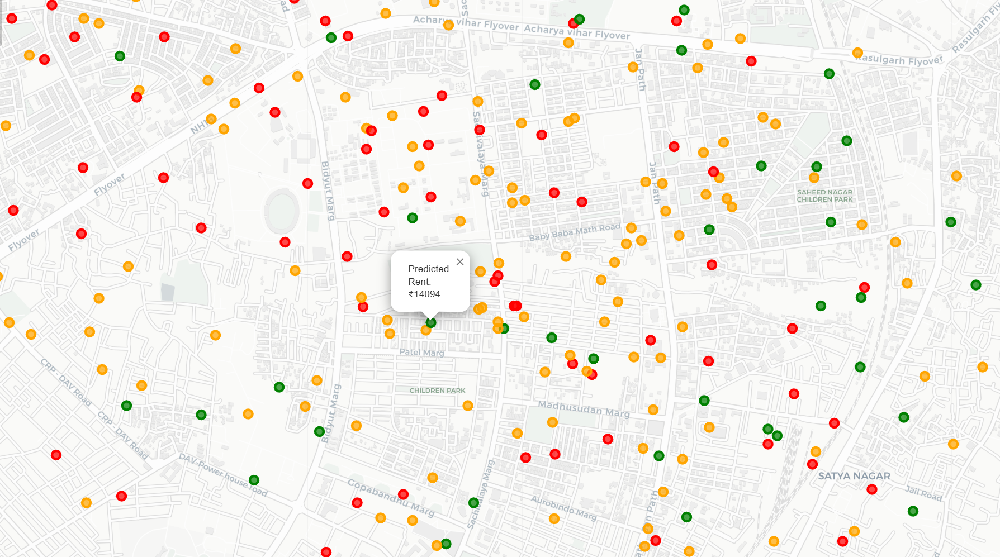
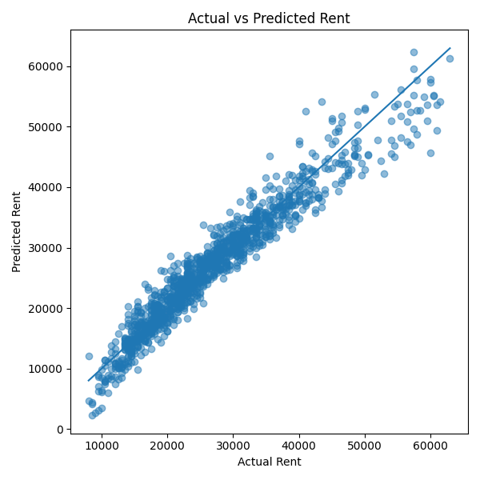

# Bhubaneswar Rent Prediction — ML + GIS Pipeline

End-to-end regression pipeline for predicting housing rent in Bhubaneswar, with geospatial feature engineering and interactive map deployment.

**Live Map →** [armaanjain-byte.github.io/BBS_Rent_Prediction-ML/map.html](https://armaanjain-byte.github.io/BBS_Rent_Prediction-ML/map.html)

---

## What This Is

A complete ML pipeline: raw data → feature engineering → model evaluation → interactive deployed visualization.

The project focuses on building domain-aware features rather than throwing raw coordinates at a regressor. Spatial accessibility isn't a given — it's engineered.

---

## Visualization

### Rent Prediction Map

<!-- Map screenshot placeholder -->


### Actual vs Predicted

<!-- Actual vs Predicted scatter placeholder -->


---

## Stack

| Layer | Technology |
|---|---|
| Data | Pandas, NumPy |
| Modeling | Scikit-learn |
| Geospatial | Folium |
| Deployment | GitHub Pages |

---

## Feature Engineering

Standard rental datasets use raw coordinates. This project engineers accessibility as a first-class signal.

**`job_access_score`**
Inverse-distance weighted proximity to employment hubs. Closer = higher score. Captures walkability-to-work effects on rent.

**`overall_access_score`**
Composite metric combining transit, commercial, and employment proximity into a single normalized score.

Both features outperformed raw lat/lng in ablation — the model picks up the constructed signal, not just location noise.

---

## Model Evaluation

5-fold cross-validation on all models. No test-set contamination — scalers and encoders fit on training folds only.

| Model | R² (CV) | Notes |
|---|---|---|
| Linear Regression | **0.927** | Best generalization |
| Lasso Regression | 0.926 | Stable, slight regularization benefit |
| Ridge Regression | 0.923 | Stable |
| Random Forest | 0.904 | Higher variance, no lift |

**Why Linear beats Random Forest here:** The engineered features have largely linear relationships with rent. Adding model complexity doesn't improve generalization when the signal is already well-structured. This is the expected outcome — and the validation that feature engineering did its job.

---

## Pipeline Design

```
raw_data/
    ↓ audit + leakage check
feature_engineering.py
    ↓ job_access_score, overall_access_score
model_training.py
    ↓ 5-fold CV across 4 regressors
evaluation.py
    ↓ R², actual vs predicted
map_builder.py
    ↓ Folium choropleth
map.html → GitHub Pages
```

---

## Project Structure

```
BBS_Rent_Prediction-ML/
│
├── data/
├── notebooks/
│   └── 01_eda.ipynb
├── outputs/
│   ├── map.png
│   └── actual_vs_predicted.png
├── map.html
├── README.md
└── LICENSE
```

---

## Key Engineering Decisions

**Cross-validation over train/test split** — with a small local dataset, a single holdout split produces unstable estimates. 5-fold CV gives a more reliable R² distribution.

**Linear model as baseline and winner** — treating linear regression as a sanity check first, not an afterthought. When it outperforms the ensemble, that's signal, not failure.

**Inverse distance weighting** — chosen over raw proximity because rent sensitivity isn't linear with distance; it drops off steeply. IDW approximates this better than a straight Euclidean distance feature.

---

## Author

**Armaan Jain** · [github.com/armaanjain-byte](https://github.com/armaanjain-byte)
